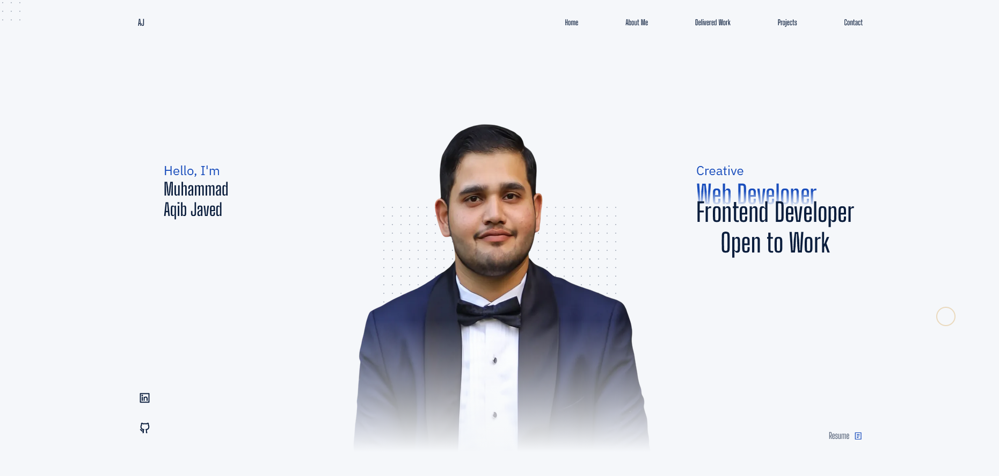

# Muhammad Aqib Javed | Portfolio

Personal portfolio site built with **Vanilla HTML, CSS and JavaScript** — no framework, no build step.



## Live Demo

**[View Live Portfolio](https://portfolio-muhammad-aqibjaved.netlify.app/)**

## Sections

- **Home** — intro, profession rotator, social links and resume link.
- **About** — short bio and resume link.
- **Delivered Work** — real client project for Perth Dynamic Solutions, including client feedback and proof-of-review lightbox.
- **Projects** — selected practice builds presented with an interactive Swiper.js carousel.
- **Work Experience / Education** — tabbed timeline with JavaScript interactions.
- **Services** — Frontend Development and WordPress Development service cards.
- **Contact** — click-to-copy email, WhatsApp and social links.
- **Footer** — automatically updates the current year with JavaScript.

## Features

- Fully responsive design
- Vanilla HTML, CSS & JavaScript
- Smooth scroll animations
- Interactive project carousel
- Custom cursor and blob animations
- Project lightbox
- Copy-to-clipboard email
- Responsive navigation
- Mobile-friendly layout

## Tech

- HTML5
- CSS3
- Vanilla JavaScript
- ScrollReveal.js — scroll animations
- Anime.js — animations
- Swiper.js — project carousel
- Self-hosted RemixIcon subset
- Fonts: Big Shoulders Display, IBM Plex Sans, IBM Plex Mono

## Structure

```text
portfolio-website/
├── index.html
└── assets/
    ├── css/
    ├── js/
    ├── img/
    │   ├── PDS/
    │   └── clone screenshots/
    └── ...
```

## Deployment

Live portfolio:

**https://portfolio-muhammad-aqibjaved.netlify.app/**

## Contact

**Email:** maqibjaved.dev@gmail.com  
**GitHub:** https://github.com/aqibarbi  
**Location:** Bahawalpur, Pakistan
